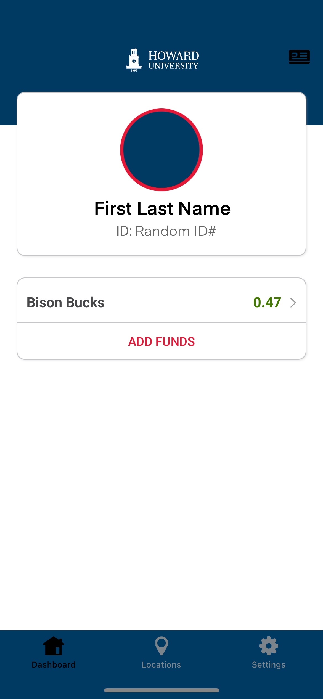

````markdown
# IDApp

A simple mobile app built with **React Native and Expo** that displays a main screen and an ID image screen. The user can tap the top-right of the main screen to view their ID, and double-tap the ID image to return to the main screen.  

---

## Table of Contents
- [Demo](#demo)  
- [Features](#features)  
- [Screenshots](#screenshots)  
- [Technologies](#technologies)  
- [Installation](#installation)  
- [Usage](#usage)  
- [Project Structure](#project-structure)  
- [Contributing](#contributing)  
- [License](#license)  

---

## Demo
*(Optional: Add a GIF or screenshots of your app in action here)*

---

## Features
- Main screen displaying a portrait image.  
- Tap the top-right corner to switch to the ID image screen.  
- Double-tap the ID image to return to the main screen.  
- Compatible with iPhone 12 Pro and up.  
- Lightweight and minimal design.  

---

## Screenshots
| Main Screen | ID Screen |
|------------|-----------|
|  |  |

---

## Technologies
- **React Native**  
- **Expo**  
- **TypeScript**  
- **Node.js**  
- **VS Code**  

---

## Installation

1. **Clone the repository**
```bash
git clone https://github.com/ProphetOgedengbe/IDApp.git
cd IDApp
````

2. **Install dependencies**

```bash
npm install
```

3. **Start Expo**

```bash
npx expo start
```

4. **Run on device**

* Scan the QR code with the **Expo Go app** (iOS or Android)
* Or press `i` to launch the **iOS Simulator**

---

## Usage

1. Open the app.
2. Tap the **top-right corner** of the main image to show the ID.
3. **Double-tap the ID image** to return to the main screen.

---

## Project Structure

```
IDApp/
├─ assets/           # Images used in the app
│  ├─ main_image.jpg
│  └─ id_image.jpg
├─ App.tsx           # Main React Native component
├─ package.json
├─ tsconfig.json
└─ .gitignore
```

---

## Contributing

Contributions are welcome!

1. Fork the repo.
2. Create a branch: `git checkout -b feature-name`
3. Make your changes.
4. Commit: `git commit -m "Add feature"`
5. Push: `git push origin feature-name`
6. Open a Pull Request.

---

## License

This project is open-source and available under the **MIT License**.

```

---

This README:  
- Explains **what your app does**  
- Includes **installation and usage instructions**  
- Shows **project structure and screenshots**  
- Provides guidance for **contributions**  

---

If you want, I can **also add a more visual version with badges, QR code for Expo Go, and “Run on iOS/Android” instructions** to make it look even more professional for GitHub.  

Do you want me to do that next?
```
